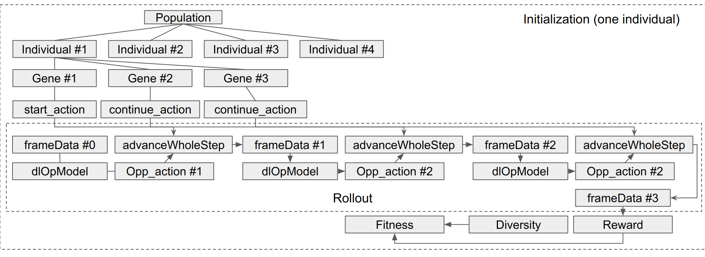
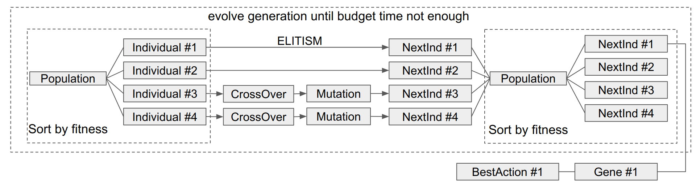

# FigthingICE Introduction

[Office Website](http://www.ice.ci.ritsumei.ac.jp/~ftgaic/index.htm)

## Game mechanics

- Game core written in Java and also wrapped for python by py4j
- Game is played asynchronously in real time.
- Game runs in 60fps, each frame take 16.66ms. AI need to finish calculation and make action within this time interval
- 15 frames delay are introduced if using the raw frame data, no delay if using visual (pixel) data
- Each game contains 3 rounds, each rounds take at most 60s. Each character has 400 initial HP. After each round, the characters' positions and HPs will be reset
- If an input from the AI is not passed, Game will consider the AI's last input as a new input. For example, if AI has used 22ms to decide its input based on the previous frame's information, it will only have 11.34ms (16.67 * 2 - 22) left to make its decision with the latest game situation, with a delay of 15 frames

For more details about this Fighint Game mechanics, please refer to

1. [Introduction of the game flow](http://www.ice.ci.ritsumei.ac.jp/~ftgaic/Downloadfiles/Introduction%20of%20the%20game%20flow.pdf)
2. [Information about the character](http://www.ice.ci.ritsumei.ac.jp/~ftgaic/Downloadfiles/Information%20about%20the%20character.pdf)
3. [Information about the combo system](http://www.ice.ci.ritsumei.ac.jp/~ftgaic/Downloadfiles/ComboSystem.pdf)
4. [Introduction of the CommandCenter class](http://www.ice.ci.ritsumei.ac.jp/~ftgaic/Downloadfiles/Introduction%20of%20the%20CommandCenter%20class.pdf)

## Competition Rules

- Two leagues (Standard and Speedrunning) are associated to each of the three character types, so there are total six leagues.
- In the Standard League, Winner is the one with the HP above zero at the time its opponent's HP has reached zero in a round. The league for a given character type is conducted in a round-robin fashion with two games for any pair of entry AIs switching P1 and P2. The AI with highest number of winning rounds becomes the league winner; If necessary, remaining HPs are used for breaking ties.
- In the Speedrunning League, winner of a given character type is the AI with the shortest average time to beat the sample MctsAi. If MctsAi cannot be beaten in 60s, the beating time of its opponent entry AI is penalized to 70s.
- Zen's official character data are available in advance while the official character data of Garnet and Lud will not be revealed
- The competition winner is finally decided by the sum of league points across all six leagues.
- AI controller will be given 5 seconds as ready time to initialize
- AI controller can use a maximum of 1GB of memory (including the game)
- No multi thread allowed
- Only allowed to read and write files in directory under data/aiData. Any file written may not exceed 50MB

## Action Space

When the character is on ground, all AIR actions will be considered invalid by the simulator. Likewise, all GROUND actions are considered invalid if the character is in air. There are total 56 actions avaiable.

```python
0:AIR
1:AIR_A
2:AIR_B
3:AIR_D_DB_BA
4:AIR_D_DB_BB
5:AIR_D_DF_FA
6:AIR_D_DF_FB
7:AIR_DA
8:AIR_DB
9:AIR_F_D_DFA
10:AIR_F_D_DFB
11:AIR_FA
12:AIR_FB
13:AIR_GUARD
14:AIR_GUARD_RECOV
15:AIR_RECOV
16:AIR_UA
17:AIR_UB
18:BACK_JUMP
19:BACK_STEP
20:CHANGE_DOWN
21:CROUCH
22:CROUCH_A
23:CROUCH_B
24:CROUCH_FA
25:CROUCH_FB
26:CROUCH_GUARD
27:CROUCH_GUARD_RECOV
28:CROUCH_RECOV
29:DASH
30:DOWN
31:FOR_JUMP
32:FORWARD_WALK
33:JUMP
34:LANDING
35:NEUTRAL
36:RISE
37:STAND
38:STAND_A
39:STAND_B
40:STAND_D_DB_BA
41:STAND_D_DB_BB
42:STAND_D_DF_FA
43:STAND_D_DF_FB
44:STAND_D_DF_FC
45:STAND_F_D_DFA
46:STAND_F_D_DFB
47:STAND_FA
48:STAND_FB
49:STAND_GUARD
50:STAND_GUARD_RECOV
51:STAND_RECOV
52:THROW_A
53:THROW_B
54:THROW_HIT
55:THROW_SUFFER
```

For details please refer to [Action.java](https://github.com/TeamFightingICE/FightingICE/blob/master/src/enumerate/Action.java)

## Observation Space

### From FrameData

```java
FrameData.class
int currentFrameNumber
int currentRound
boolean emptyFlag
```

```java
CharacterData.class /*p1 and p2 instances are different*/
boolean playerNumber /*true} if the character is P1, or {@code false} if P2.*/
int hp
int energy
int x /*The character graphic's most top-left x-coordinate. */
int y /*The character graphic's most top-left y-coordinate */
int left /*The character's hit box's most-left x-coordinate.*/
int right /* The character's hit box's most-right x-coordinate.*/
int top /*The character's hit box's most-top y-coordinate.*/
int bottom /*The character's hit box's most-bottom y-coordinate.*/
int speedX /*The character's vertical speed.*/
int speedY /*The character's vertical speed.*/
int graphicSizeX /*The character's graphic width*/
int graphicSizeY /*The character's graphic height*/
int graphicAdjustX /*The amount of movement in the horizontal direction used to adjust the x coordinate when determining the direction of the character.*/
boolean front /*The character's facing direction, true if the character is facing right*/
boolean control /*The flag whether this character can run a new motion with the motion's command */
int remainingFrame /*The number of frames that the character needs to resume to its normal status.*/
boolean hitConfirm /*The flag whether this character can run a new motion with the motion's command */
int hitCount /* The continuous hit count of attacks used by this character*/
int lastHitFrame /*The frame number of the last frame that an attack used by this character hit the opponent.*/
State state /*The character's state*/
Action action /*The character's action*/
AttackData attackData /*The attack data that the character is using*/
Deque<Key> inputCommands /*The list storing keys of the action that the character will be executing in the simulator */
Deque<Key> processedCommands /*The list storing up to 30 keys that the character executed in the simulator. */
```

```java
AttackData.class
HitArea settingHitArea /*TheHitArea's information of this attack hit box set in Motion.csv.*/
HitArea currentHitArea /*The HitArea's information of this attack hit box in the current frame.*/
int settingSpeedX /*The absolute value of the horizontal speed of the attack hit box (zero  means the attack hit box will track the character) */
int settingSpeedY 
int currentFrame /*The number of frames since this attack was used*/
boolean playerNumber /**/
int speedX /*The horizontal speed of the attack hit box (minus when moving left and plus when moving right)*/
int speedY /*The vertical speed of the attack hit box (minus when moving up and plus when moving down).*/
int startUp /*The number of frames in Startup.*/
int active /*The number of frames in Active.*/
int hitDamage /*The damage value to the unguarded opponent hit by this skill.*/
int guardDamage /*The damage value to the guarded opponent hit by this skill.*/
int startAddEnergy /*The value of the energy added to the character when it uses this skill.*/
int hitAddEnergy /*The value of the energy added to the character when this skill hits the opponent. */
int guardAddEnergy /*The value of the energy added to the character when this skill is blocked by the opponent. */
int giveEnergy /*The value of the energy added to the opponent when it is hit by this skill.*/
int impactX /*The change in the horizontal speed of the opponent when it is hit by this skill. */
int impactY /**/
int giveGuardRecov /*The number of frames that the guarded opponent needs to resume to his  normal status after being hit by this skill. */
int attackType /*The value of the attack type: 1 = high, 2 = middle, 3 = low, 4 = throw.*/
boolean downProp  /*The flag whether this skill can push down the opponent when hit.*/
boolean isProjectile /*The flag whether this skill is projectile or not.<br>*/
```

For the details please refer to [FrameData.java](https://github.com/TeamFightingICE/FightingICE/blob/master/src/struct/FrameData.java#L14), [CharacterData.java](https://github.com/TeamFightingICE/FightingICE/blob/master/src/struct/CharacterData.java#L14), [AttackData.java](https://github.com/TeamFightingICE/FightingICE/blob/master/src/struct/AttackData.java#L9)

### From ScreenData

Obtains RGB data of the screen in the form of ByteBuffer. **Note: If the window is disabled, will just return a black buffer**
Details please refer to [ScreenData.java](https://github.com/TeamFightingICE/FightingICE/blob/master/src/struct/ScreenData.java#L22).

## Gym Encapsulation

Overall introduction of this Gym env please refer to [gym-fightingice](https://github.com/TeamFightingICE/Gym-FightingICE)

4 envs can be used:

- FightingiceDataNoFrameskip-v0
- FightingiceDataFrameskip-v0
- FightingiceDisplayNoFrameskip-v0
- FightingiceDisplayFrameskip-v0

The envs with "Data" returns a vector of game data with a delay of 15 frames as obs;
The envs with "Display" returns an ndarray with no frame delay as obs, but FightingICE will run slower in this mode.
The envs with "Frameskip"

### Gym Action Space

same as the java one, contains **56** actions

### Gym Observation Space

#### Data Envs

If using the "Data" envs, it will return totally **143** processed data from FrameData. The following code show same example

```python
my = self.frameData.getCharacter(self.player)

# my information
myHp = abs(my.getHp() / 400)
myEnergy = my.getEnergy() / 300
myX = ((my.getLeft() + my.getRight()) / 2) / 960
myY = ((my.getBottom() + my.getTop()) / 2) / 640
mySpeedX = my.getSpeedX() / 15
mySpeedY = my.getSpeedY() / 28
myState = my.getAction().ordinal() # This would further convert into one-hot code for the 56 actions
myRemainingFrame = my.getRemainingFrame() / 70

# opp information
# ...
observation.append(myHp)
observation.append(myEnergy)

game_frame_num = self.frameData.getFramesNumber() / 3600

myProjectiles = self.frameData.getProjectilesByP1()
if len(myProjectiles) == 2:
    myHitDamage = myProjectiles[0].getHitDamage() / 200.0
    myHitAreaNowX = ((myProjectiles[0].getCurrentHitArea().getLeft() + myProjectiles[0].getCurrentHitArea().getRight()) / 2) / 960.0
    # ...

observation = np.array(observation, dtype=np.float32)
observation = np.clip(observation, 0, 1)
```

Basically the current gym Encapsulation only returned a simplified obs data from the original one. It might lose some information especially for the collision detection as it only return the centralized coordinations. We might need to extent this observation space in the future. For detailes please refer to [gym_ai.py](https://github.com/TeamFightingICE/Gym-FightingICE/blob/master/gym_fightingice/envs/gym_ai.py#L126).

#### Display Envs

The original display data is same as java one. In this gym Encapsulation it receive the gray rescaled image of size (96,64,1). Here still need to enable the window to receive the correct pixel data.

## AI Inferface

For both Java and Python implementation, the AI need to extend/implement the interface of AIIInterface. The major task for AI is to calculate the **best action**  according to the **observation**.

```java
public interface AIInterface {
    int initialize(GameData gd, boolean playerNumber);
    void getInformation(FrameData fd); /*receive data from FrameData*/
    void processing(); /*processing and calculation for AI*/
    Key input(); /*sent input actions*/
    void close(); /*Finalizes AI*/
    void roundEnd(int p1Hp, int p2Hp, int frames);/*Informs the result of each round*/
    default void getScreenData(ScreenData sd) {};
}
```

For the details please refer to [AIInterface.java](https://github.com/TeamFightingICE/FightingICE/blob/master/src/aiinterface/AIInterface.java#L11)

## 2019 Competition

### Champion: ReiwaThunder

#### AI implementation

ReiwaThunder implements 6 Seperate AI controllers to deal with 6 different leagues plus a default AI to handle other cases:

- Zen Standard
- Zen SpeedRunning
- Lud Standard
- Lud Speedrunning
- Garnet Stardard
- Garnet SpeedRunning
- default MyAI.

ReiwaThunder using simlulator to address the 15 frames delay, which means it using the delayed framedata (which is the data 15 frames ago) to simulate the current framedata. Then perform calculation on the simulated framedata.

Although there are 6 different implementations, the overall `doAct()` method in `processing` to get the best action in each frame is similar. Take `UseZenAI` as an example

1. create `myActs` and `oppActs` list according to the corresponding character state, for example: `if(opp.getState()!=State.AIR)opacs=Grob.actionGround;}else{opacs=Grob.actionAir;}`
2. select action `myActionsEnoughEnergy` and `oppActionsEnoughEnergy` with enough energy from the above lists
3. Return certain actions if current state meet some pre-set condition with/without simluation. it considers GUARD with high priority when being forced to the corner and kicked down.
Simluation methods like `getMinHpScore(Action myact,List<Action> opAcs)` will simulat 50 frame according to the myact and opActs to return the hpscore. `score = gapMyHp-gapOpHp`. For example, `if(calc.getMinHpScore(tac=Action.STAND_B,moveActs)>0){return (tac);}`
4. `myActs` is further divided into 3 list `HittingMyActions`, `movingActions`, `nigeActions` with `getMinMaxHp(List<Action> myAcs,List<Action> opAcs)` method to select the best action to perform.

The above is the overall description of the ReiwaThunder Zen Standard AI, the differences among AIs are shown in the following table, compared with the Zen Standard AI.

|AI|major Difference|
|----|----|
| Zen Standard | Consider GUARD with high priority when being forced to the corner and kicked down. <br> Using getMinMaxHp with HittingMyActions, movingActions, nigeActions to handle different state |
|Zen SpeedRunning | No nigeActions, No GUARD actions. <br> `myActs` exclude BACK_STEP, BACK_JUMP, AIR_FA, AIR_FB etcs. <br> Directly return the best attack action using turning score without MinMax |
|Lud Standard | Using getMinMaxIfDamage with HittingMyActions, movingActions, nigeActions to handle different state |
|Lud SpeedRunning | No nigeActions <br> Using getMinMaxIfDamage with HittingMyActions, movingActions, nigeActions to handle different state |
|Garnet Standard| Fine-grained process for moving actions. <br> Additional jumpActions|
|Garnet SpeedRunning |No nigeActions, No GUARD actions. <br> `myActs` exclude BACK_STEP, BACK_JUMP, AIR_FA, AIR_FB etcs. <br> Using getMinMaxHp with HittingMyActions, <br> Using getMinMaxIfDamage with movingActions |
|MyAI Standard & SpeedRunning| No nigeActions, different GUARD strategy. <br> Using MCTS-UCB with movingActions, HittingMyActions to handle different states. <br> The MCT depth is 2. <br> The mct.playout use the same simulation and get same score as the getMinMaxHp method while only consider limited actions from `myActs and `oppActs` |

#### Conclusion

ReiwaThunder implemented fine-grained AIs to optimize the performance in different leagues. Each individual AI is more like a rule based one with MinMax and MCTS algorithm to search in limited depth. They are overall excellent agents but not general game AI. 
This implementation requires the author to be very familiar with the game and have a deep understanding on the game mechanics.

### Second Place: RHEA_PI

#### AI implementation

The RHEA_PI agent is an general game AI, it using Rolling Horizen Evolutionary Algorithm (RHEA) combined with a opponent model to select the best action for 6 leagues. 
RHEA_PI also take reference from Thunder (The previous version of RewiaThunder), It also using the simulator to simulate 14 frameData to address the delay problem and divdide the actions into `actionGround`, `actionAir`, `myActionsEnoughEnergy`, `oppActionsEnoughEnergy`. 

While under some special conditions it will also return certain actions directly , for example

```java
if ((myAct == Action.DOWN || myAct == Action.RISE || myAct == Action.CHANGE_DOWN) && opp.getState() != State.AIR){
    if (this.lastOppAttackMotion.attackType==2)    return "4 4 4 4 4 4 4 4 4 4 4 4 4 4 4 4 4 4 4 4 4 4";
    else return "1 1 1 1 1 1 1 1 1 1 1 1 1 1 1 1 1 1";
}
```
**RHEA based method**
The budge-time for calculation/prediction is the frame time interval: 16.5ms

**1. Initialization**
For the first frame, RHEA will initialize a `population`, which contains `POPULATION_SIZE=4` `individuals`. Each `Indiviual` contains `SIMULATION_DEPTH=3` `Genes`. Each `Gene` contains `INNER_MACRO_ACTION_LENGTH=1` macro actions. 

The overall algorithm flow is illustrated in the following figure



The reward get after the rollout and evaluation is `double rawScore = (double)(myHp - oppHp + my.getHitCount() - opp.getHitCount());`
The `Individual` class implemented the `compareTo` Interface, thus it could be sorted. The sort key is `fitness=value * (1-player.params.D) + diversity * player.params.D;`. The `value` is the latest added reward.

**2. Eovlution**


**3. Rolling Horizen**
For the later frames, each `Gene` of an `Inidividual` will pop the first action and add random action into the end. Then reset the `Inidividual` value.

#### Opponent Model

1. Build using one layer linear network with `gradientNormalization`, `Adam Optimizer`, `Softmax`, `PI Loss`
2. record/stack input/output pair in each frame with method `public void record(GameData gd, FrameData fd, boolean player, int target)`
3. Input (12): `{myHp, myEnergy, myPosX, myPosY, myState, oppHp, oppEnergy, oppPosX, oppPosY, oppState, distX, distY}` from `gameData` and `frameData`
4. Output: Probabilities of opponent actions. In the prediction, the result will filtered the invalid action.

#### Conclusion
RHEA_PI is a general AI for the FightingICE, partially take reference from the **Thunder** to handle special conditions. RHEA_PI used single layer neural network to predict the opponent action and implemented Rolling Horizen Evolutionary Algorithm to perform best action for each frame. I think we can take this implementation as an example to sovle the oppenment model problem

### Third Place Toothless

To be Continued...